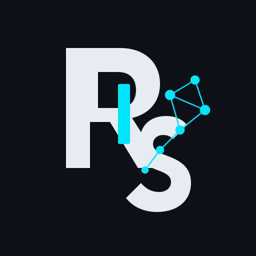

<p align="center">
  
</p>

<h1 align="center">rs-llama</h1>

<p align="center">
  <strong>Rust library and CLI for running GGUF models through <a href="https://github.com/ggml-org/llama.cpp">llama.cpp</a></strong>
</p>

<p align="center">
  <a href="https://dhhieu113pro.github.io/rs-llama/">Website</a> ·
  <a href="https://github.com/dhhieu113pro/rs-llama/releases">Releases</a> ·
  <a href="https://github.com/dhhieu113pro/rs-llama">GitHub</a>
</p>

<p align="center">
  <a href="https://github.com/dhhieu113pro/rs-llama/actions/workflows/ci.yml">
    
  </a>
  
  
  
  
  
</p>

---

## Automatic GPU acceleration

A normal build now selects the best available llama.cpp backend automatically. No Cargo feature is required for the common case.

| Target | Automatic selection |
|---|---|
| Windows / Linux | CUDA → Vulkan → CPU |
| macOS | Metal |
| Android / Termux | CPU |

CUDA is selected when a usable CUDA toolkit is found through `CUDA_PATH`, `CUDA_HOME`, `CUDA_ROOT`, `/usr/local/cuda`, or `nvcc`. Vulkan is selected when `VULKAN_SDK` is available; on Linux, the Vulkan development package can also be discovered through `pkg-config` or standard include/library paths.

The selected backend is reported when the CLI starts:

```text
Backend: CUDA (auto)
```

`EngineConfig` and the CLI default to `999` GPU layers, which asks llama.cpp to offload all model layers it can. Use `--gpu-layers 0` or `.with_gpu_layers(0)` when you want CPU inference with the compiled binary.

### Backend override

`RS_LLAMA_BACKEND` is a **build-time** override:

```bash
RS_LLAMA_BACKEND=cpu cargo build --release
RS_LLAMA_BACKEND=cuda cargo build --release
RS_LLAMA_BACKEND=vulkan cargo build --release
RS_LLAMA_BACKEND=metal cargo build --release
```

Accepted values are `auto`, `cpu`, `cuda`, `vulkan`, and `metal`. Explicit Cargo features remain supported when a deterministic build is preferred:

```bash
cargo build --release --features cuda
cargo build --release --features vulkan
cargo build --release --features metal
```

Enable only one GPU feature at a time. A non-`auto` `RS_LLAMA_BACKEND` value cannot be combined with a GPU Cargo feature.

## Platforms

| Platform              | CI                          | Release asset                        |
|-----------------------|-----------------------------|--------------------------------------|
| Linux x86_64          | LED smoke + vision          | `rs-llama-linux-x86_64.tar.gz`       |
| Windows x86_64        | LED smoke + vision          | `rs-llama-windows-x86_64.zip`        |
| macOS Apple Silicon   | Metal + LED smoke + vision  | `rs-llama-macos-arm64.tar.gz`        |
| Android / Termux arm64| NDK build + emulator vision | `rs-llama-android-arm64.tar.gz`      |
| Vulkan                | Linux compile               | `--features vulkan`                  |

Tags `v*` publish the four binaries plus `SHA256SUMS`.

```bash
curl -L -O https://github.com/dhhieu113pro/rs-llama/releases/latest/download/rs-llama-linux-x86_64.tar.gz
tar -xzf rs-llama-linux-x86_64.tar.gz
./rs-llama-linux-x86_64/rs-llama --help
```

## Architecture

```text
rs-llama CLI + library
    |
    +--> Hugging Face download / cache + mmproj
    v
LlamaEngine
    v
llama.cpp / ggml
```

## Requirements

- Rust toolchain
- Git
- C/C++ compiler, CMake, Clang / libclang
- Optional CUDA toolkit for the CUDA backend
- Optional Vulkan SDK/development package for the Vulkan backend

```bash
export LLAMA_CPP_SRC=/path/to/llama.cpp
export LLAMA_CPP_REV=master   # or a pinned commit
```

## Install (library)

```toml
[dependencies]
rs-llama = { git = "https://github.com/dhhieu113pro/rs-llama" }
```

```rust
use rs_llama::{
    compiled_backend, download_huggingface_model_bundle, EngineConfig, GenerateRequest,
    HfDownload, LlamaEngine,
};

fn main() -> anyhow::Result<()> {
    let bundle = download_huggingface_model_bundle(&HfDownload::new(
        "mradermacher/SmolLM2-135M-Instruct-GGUF",
        "SmolLM2-135M-Instruct.Q4_K_M.gguf",
    ))?;

    // GPU offload is automatic when the compiled backend supports it.
    let engine = LlamaEngine::load(
        EngineConfig::new(bundle.model_path).with_ctx_size(1024),
    )?;

    println!("backend: {}", compiled_backend());
    let out = engine.generate(
        &GenerateRequest::new("What is an LED lamp?").with_chat(true),
    )?;
    println!("{out}");
    Ok(())
}
```

## Build

For most systems, just build normally and let rs-llama choose the backend:

```bash
cargo build --release
```

Android / Termux: see [docs/ANDROID.md](docs/ANDROID.md)

```bash
bash scripts/termux-build.sh
bash scripts/termux-smoke.sh
```

## Run (CLI)

Instruct models need `--chat`.

```bash
cargo run --release -- \
  --hf-repo mradermacher/SmolLM2-135M-Instruct-GGUF \
  --hf-file SmolLM2-135M-Instruct.Q4_K_M.gguf \
  --chat --no-echo-prompt \
  --prompt "What is an LED lamp?"
```

Force model layers to stay on CPU at runtime:

```bash
cargo run --release -- --model ./model.gguf --gpu-layers 0
```

## Vision / mmproj

CI generates a text image (`LED LAMP`) and runs `--image` on Linux, Windows, macOS, and an Android x86_64 emulator.

```bash
cargo run --release -- \
  --hf-repo ggml-org/SmolVLM-256M-Instruct-GGUF \
  --hf-file SmolVLM-256M-Instruct-Q8_0.gguf \
  --image ./photo.jpg \
  --chat \
  --prompt "What is in this image?"
```

## Continuous integration

| Check                        | Where                          |
|------------------------------|--------------------------------|
| Backend selection policy     | Pure Rust, no GPU required     |
| CPU + LED lamp smoke         | Linux, Windows, macOS          |
| Vision image + mmproj        | Linux, Windows, macOS          |
| Vision image + mmproj        | Android emulator x86_64        |
| Metal                        | macOS                          |
| Vulkan compile               | Linux                          |
| Android arm64 release binary | NDK `arm64-v8a`                |

## License

MIT

---

<p align="center">
  <a href="https://dhhieu113pro.github.io/rs-llama/">dhhieu113pro.github.io/rs-llama</a>
</p>
